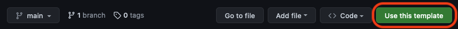
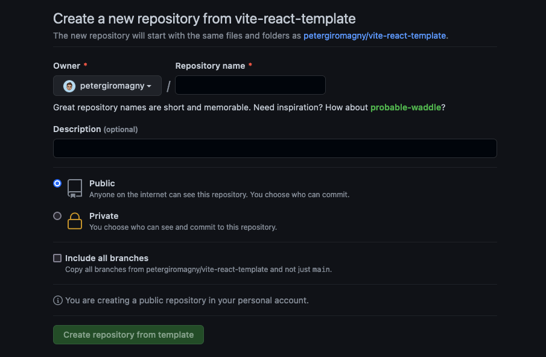

<h1 align="center">Vite - React template</h1>

<p align="center">
    
    
    
    
</p>

<br>

<div align="center">
    
    &nbsp;&nbsp;&nbsp;&nbsp;
    
</div>

<br>

<div align="center">
    <a href="https://www.typescriptlang.org/" target="_blank" rel="noreferrer"> 
         
    </a>
    &nbsp;&nbsp;&nbsp;&nbsp;
    <a href="https://tailwindcss.com/" target="_blank" rel="noreferrer">
        
    </a> 
    &nbsp;&nbsp;&nbsp;&nbsp;
    <a href="https://yarnpkg.com/" target="_blank" rel="noreferrer">
        
    </a>
    &nbsp;&nbsp;&nbsp;&nbsp;
    <a href="https://eslint.org/" target="_blank" rel="noreferrer"> 
         
    </a>
    &nbsp;&nbsp;&nbsp;&nbsp;
    <a href="https://prettier.io/" target="_blank" rel="noreferrer"> 
         
    </a>
    &nbsp;&nbsp;&nbsp;&nbsp;
    <a href="https://typicode.github.io/husky/#/" target="_blank" rel="noreferrer">
        <span style="font-size: 40px" role="img" aria-label="Husky">🐶</span>
    </a>
</div>
<br>

Template to start a Vite - React App project with all essential configuration (ESLint, Prettier, Husky and Tailwind).

## Install

Use this template to create your project


Create a new repository from this template


Clone your new repository (HTTPS or SSH clone)
```bash
git clone https://github.com/[your-username]/[your-new-repo-name].git
```
```bash
git clone git@github.com:[your-username]/[your-new-repo-name].git
```


Go to the project directory
```bash
  cd [your-new-repo-name]
```

Install dependencies
```bash
yarn
```
```bash
npm install
```

Start project
```bash
yarn dev
```
```bash
npm run dev
```

## Usage

### ESLint
```bash
yarn lint
```
```bash
npm run lint
```

### Prettier
```bash
yarn prettier
```
```bash
npm run prettier
```

### Husky

Init Husky
```bash
yarn husky:init
```
```bash
npm run husky:init
```

> **Note**
> 
> If you're using <code>npm</code> you have to update Husky pre-commit
> ```bash
> npx husky set .husky/pre-commit "npm run lint && npm run prettier"
> ```

- Edit <code>App.tsx</code> file
- Save and add modification to local repo with: <code>git add App.tsx</code>
- Then commit changes: <code>git commit -m "Update App.jsx"</code>

**In the terminal you gonna see <code>yarn/npm run prettier</code> followed by <code>yarn/npm run lint</code> before changes are committed on local branch**

## Follow me
👤 **Peter Giromagny**

- Instagram: [@ForAllDevkind](https://www.instagram.com/foralldevkind/)
- Github: [@petergiromagny](https://github.com/petergiromagny)
- Website: [petergiromagny.com](https://petergiromagny.com)

Please ⭐️ this repository if this project helped you!

## License

[MIT](https://choosealicense.com/licenses/mit/)